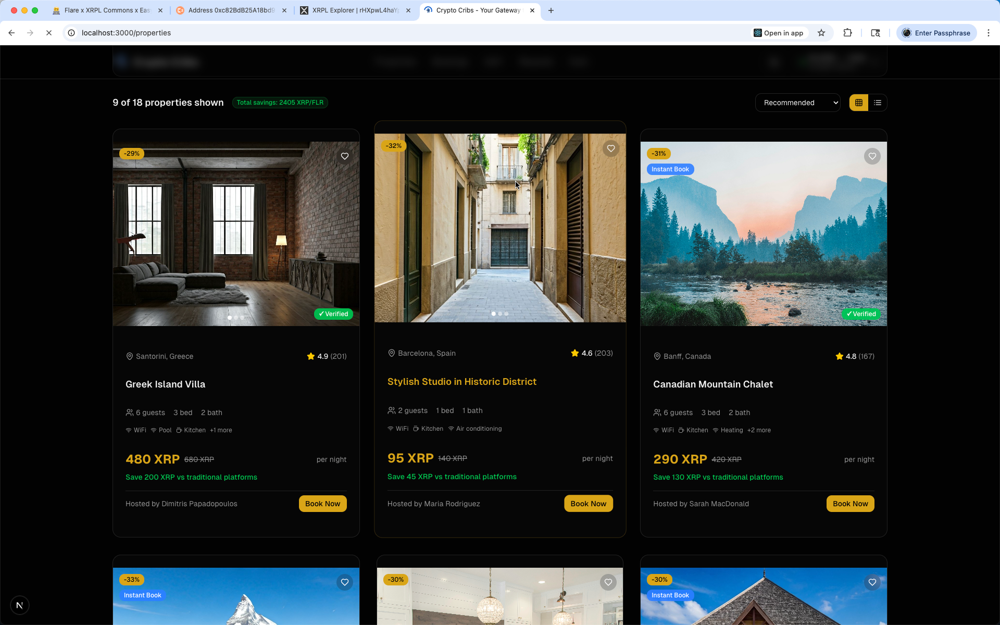
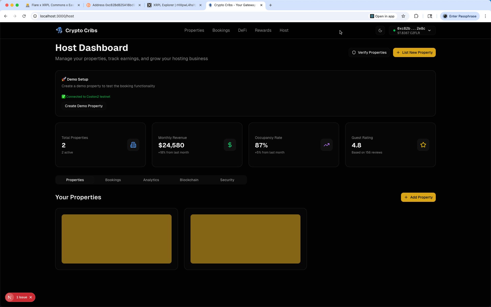
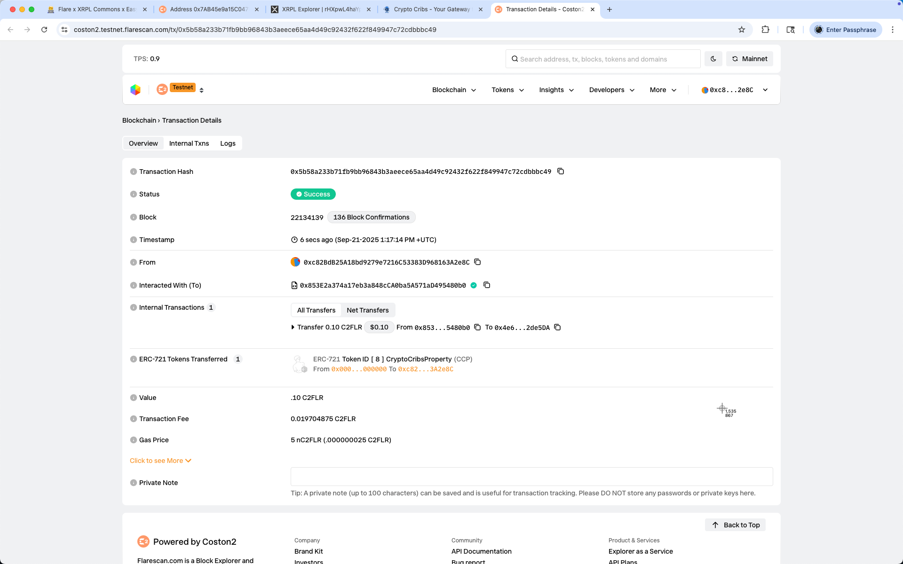
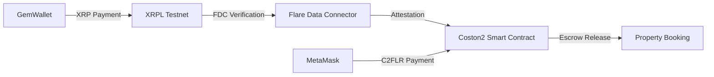

# Crypto Cribs - Decentralized Travel Platform

> **Revolutionizing travel with XRPL & Flare Network integration**

A cutting-edge decentralized travel booking platform that combines the speed of XRPL payments with the smart contract capabilities of Flare Network, creating the future of travel bookings with real cross-chain DeFi integration.

   

## 🎥 Demo Video

> **Watch the live demo showcasing real XRPL and Flare Network integration**

*Demo video coming soon - showcasing real wallet transactions and cross-chain payments*

## 📸 Screenshots

### 🏡 Property Booking Interface


### 🏢 Host Dashboard


### 💰 DeFi Staking Hub


### 🔍 Property Marketplace


## 🌟 Live Demo Features

### 🏡 Property Booking with Real Wallets
Experience seamless property bookings using your actual GemWallet and MetaMask with real testnet funds.
*Modern apartment booking with dual wallet integration - GemWallet (10 XRP) + MetaMask (98.59 C2FLR)*

### 🏢 Host Dashboard & Property Management
Complete host experience with property management, earnings tracking, and blockchain analytics.
*Professional host dashboard with real-time earnings and property management tools*

### 💰 DeFi Travel Hub - Stake & Earn
Innovative DeFi features allowing users to stake tokens while saving for their next adventure.
*Stake & Save for Travel - Earn $2,840 in portfolio value with 1250 FLR staked*

### 🔍 Property Marketplace
Browse verified properties with transparent pricing in XRP/FLR and traditional platforms comparison.
*Curated property listings with cross-chain payment options and savings indicators*

## ⚡ Key Features

### 🚀 **Cross-Chain Payments**
- **XRPL Integration**: Lightning-fast, low-cost payments via GemWallet
- **Flare Network**: Smart contract escrow and DeFi functionality
- **Real-time Bridge**: Seamless XRP ↔ FLR conversion using FTSOv2 oracles
- **Live Testnet**: Working with actual testnet funds (10 XRP + 98.59 C2FLR)

### 🛡️ **Smart Contract Security**
- **Deployed Contracts**: Live on Coston2 testnet
- **Property Escrow**: Secure booking with automatic release
- **NFT Ownership**: ERC-721 property tokens
- **Fraud Protection**: Advanced wallet verification

### 📊 **DeFi Integration**
- **Staking Rewards**: Earn while you save for travel
- **Yield Farming**: Multiple token pair opportunities
- **Portfolio Tracking**: Real-time value monitoring
- **Travel Savings Goals**: Gamified saving experience

### 🎯 **Real-World Ready**
- **Actual Wallet Integration**: GemWallet + MetaMask
- **Live Price Feeds**: FTSOv2 oracle integration
- **Transaction Verification**: Flare Data Connector (FDC)
- **Production UI/UX**: Professional travel platform design

## 🛠️ Tech Stack

| Layer | Technology | Purpose |
|-------|------------|---------|
| **Frontend** | Next.js 14, TypeScript, Tailwind CSS | Modern React framework with type safety |
| **Blockchain** | XRPL Testnet, Flare Coston2 | Dual-chain architecture |
| **Smart Contracts** | Solidity, Foundry | Secure property escrow and NFTs |
| **Wallets** | GemWallet, MetaMask | Native XRPL and EVM wallet support |
| **Oracles** | FTSOv2 | Real-time price feeds |
| **Data** | Flare Data Connector | Cross-chain verification |

## 🚀 Quick Start

### Prerequisites
- **Node.js** 18+ 
- **GemWallet** browser extension ([Install](https://gemwallet.app/))
- **MetaMask** browser extension ([Install](https://metamask.io/))
- **Testnet Funds**: XRP + C2FLR (faucets provided)

### 1. Clone & Install
```bash
git clone https://github.com/yourusername/crypto-cribs.git
cd crypto-cribs
npm install
```

### 2. Environment Setup
```bash
cp .env.example .env
# Contract addresses are pre-configured for Coston2
```

### 3. Start Development
```bash
npm run dev
# Open http://localhost:3000
```

### 4. Get Testnet Funds
- **XRPL Testnet**: [Faucet](https://faucet.altnet.rippletest.net/) (Get 1000 XRP)
- **Coston2 Testnet**: [Faucet](https://faucet.flare.network/) (Get 100 C2FLR)

## 📱 Wallet Configuration

### GemWallet (XRPL)
```javascript
// Automatic network detection
Network: XRPL Testnet
Explorer: https://testnet.xrpl.org/
```

### MetaMask (Flare Coston2)
```javascript
Network Name: Flare Testnet Coston2
RPC URL: https://coston2-api.flare.network/ext/C/rpc
Chain ID: 114
Currency: C2FLR
Explorer: https://coston2.testnet.flarescan.com
```

## 🏗️ Smart Contract Architecture

### Deployed Contracts (Coston2 Testnet)
```solidity
PropertyEscrow:     0xfaD4AD4A892F0e9f6018EB3671E8580b396CdCc1
PropertyNFT:        0x10Ec5e7be6879bc70363e86780e50bb7831CA5F4
XRPLFlarebridge:    0x6B5A678ED72CC7A910d3b3EB1CeaeF3FBA53F821
CryptoCribsBooking: 0xcf01F271DecCDdfd2CF72D3177EC2dC132fEb3a7
```

### Contract Deployment
```bash
cd contracts
forge script script/Deploy.s.sol --rpc-url $COSTON2_RPC_URL --broadcast
```

## 🎯 Usage Guide

### 1. **Connect Wallets**
- Install GemWallet & MetaMask
- Connect to XRPL Testnet & Coston2
- Fund wallets via faucets

### 2. **Browse Properties**
- Explore curated property listings
- Compare traditional vs crypto pricing
- View savings with cross-chain payments

### 3. **Make Bookings**
- Select dates and guests
- Choose XRP or FLR payment
- Experience instant cross-chain settlement

### 4. **DeFi Features**
- Stake FLR tokens for travel savings
- Earn rewards while planning trips
- Track portfolio growth in real-time

### 5. **Host Properties**
- List properties with smart contract escrow
- Receive payments in XRP/FLR
- Manage bookings via dashboard

## 🔄 Cross-Chain Flow



## 🌐 Live Demo

**Demo URL**: `http://localhost:3000` (after setup)

**Test Wallets**:
- **XRPL**: Use your GemWallet with testnet XRP
- **Flare**: Use your MetaMask with Coston2 C2FLR

**Demo Flow**:
1. Connect both wallets
2. Browse properties at `/properties`
3. Book a property with cross-chain payment
4. Explore DeFi features at `/defi`
5. Check host dashboard at `/host`

## 🤝 Contributing

We welcome contributions! Please see our [Contributing Guide](CONTRIBUTING.md).

### Development Workflow
1. Fork the repository
2. Create feature branch: `git checkout -b feature/amazing-feature`
3. Commit changes: `git commit -m 'Add amazing feature'`
4. Push to branch: `git push origin feature/amazing-feature`
5. Open Pull Request

## 📄 License

This project is licensed under the MIT License - see [LICENSE](LICENSE) for details.

## 🙏 Acknowledgments

- **XRPL Foundation** for the robust payment infrastructure
- **Flare Network** for smart contract capabilities and oracles
- **GemWallet Team** for excellent XRPL wallet integration
- **MetaMask** for seamless EVM wallet support

## 📞 Support

- **Email**: support@cryptocribs.com
- **Discord**: [Join our community](https://discord.gg/cryptocribs)
- **Twitter**: [@CryptoCribs](https://twitter.com/cryptocribs)

---

**Built with ❤️ for the future of decentralized travel**
