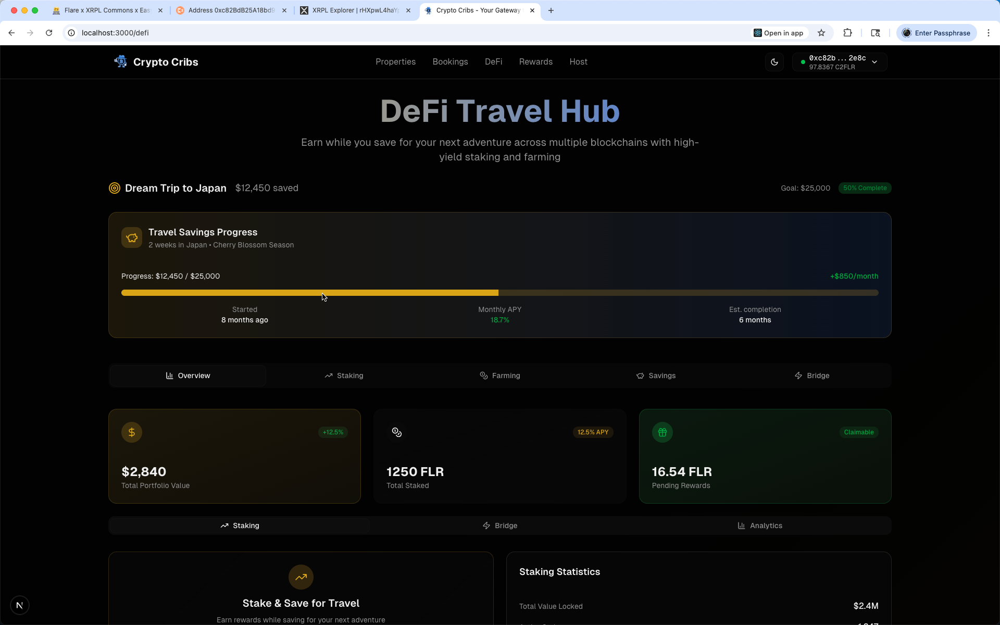

# Crypto-Cribs: Cross-Chain Decentralized Travel & Real Estate DApp

---

## 🚀 Demo Video

<!--
Replace the link below with your YouTube/Vimeo/Loom/Google Drive demo video
-->
[

---

## 🖼️ Screenshots

<!--
Replace these with actual screenshots of your DApp UI and flows.
Drop images into /public/screenshots/ and reference here as needed.
-->




---

## 🎤 Loom/Explainer Video

<!--
Replace this with a Loom video link, e.g. https://youtu.be/XXXXXXXXXXX
-->
[Watch the full walk-through with audio](https://your-loom-link.com)

---

## Table of Contents

- [Project Overview](#project-overview)
- [Judging Criteria: How CryptoCribs Satisfies the Challenge](#judging-criteria-how-cryptocribs-satisfies-the-challenge)
- [Architecture](#architecture)
  - [Tech Stack](#tech-stack)
  - [High-Level & User Journey Diagrams](#high-level--user-journey-diagrams)
  - [Cross-Chain Flow](#cross-chain-flow)
- [Directory Structure](#directory-structure)
- [Core Implementations](#core-implementations)
  - [XRPL Integration](#xrpl-integration)
  - [Flare Network & EVM Smart Contracts](#flare-network--evm-smart-contracts)
  - [Cross-Chain Bridges (FAssets, FXRP)](#cross-chain-bridges-fassets-fxrp)
  - [Wallet Integrations (GemWallet, MetaMask)](#wallet-integrations-gemwallet-metamask)
  - [Booking, Escrow & Payment Flow](#booking-escrow--payment-flow)
  - [Raffle & NFT Reward Mechanisms](#raffle--nft-reward-mechanisms)
- [Frontend Structure](#frontend-structure)
  - [Routing & Pages](#routing--pages)
  - [Reusable Components](#reusable-components)
  - [Hooks and Providers](#hooks-and-providers)
  - [UI & Styles](#ui--styles)
- [Smart Contracts Architecture](#smart-contracts-architecture)
- [How To Run Locally](#how-to-run-locally)
- [How To Deploy](#how-to-deploy)
- [Security & Compliance](#security--compliance)
- [Planned Improvements](#planned-improvements)
- [References & Sources](#references--sources)
- [Contact & Contribution](#contact--contribution)

---

## Project Overview

CryptoCribs is a decentralized travel and real estate platform that reimagines short-term rentals by replacing high-fee, centralized intermediaries like Airbnb with blockchain-powered transparency and fairness.

**The Problem:**  
Current platforms charge 15–25% in commissions, force guests to pay 100% upfront, and lock funds until check-in. This creates high costs for travelers, reduced income for hosts, and a lack of trust when refunds depend on centralized companies.

**The Solution:**  
CryptoCribs introduces a 20% deposit escrow model. Guests secure bookings by depositing 20% of the price into a smart contract. At check-in, funds are automatically released to the host, or refunded if cancellation terms apply. This reduces risk, lowers fees to near zero, and ensures fair handling of funds.

**Unique Features:**
- **NFT Loyalty & Raffles:** Every booking rewards travelers with NFT badges and raffle entries for travel credits or free stays.
- **Tokenized Real Estate Ownership:** Users can invest in fractional property tokens, combining travel with long-term real estate investment.
- **Cross-Border Simplicity:** With XRPL and Flare, payments are fast, global, and cost only fractions of a cent.

**How we used Flare & XRPL:**
- **XRPL:** Powers instant payments and token issuance, enabling seamless deposits and property tokenization.
- **Flare:** Provides smart contract escrow, decentralized oracles for fair raffles and price feeds, and FAssets to bridge XRPL assets into DeFi.

**Impact:**  
With CryptoCribs, hosts keep more income, travelers pay less, and both sides gain transparency, trust, and ownership opportunities — all powered by blockchain.

---

## Judging Criteria: How CryptoCribs Satisfies the Challenge

- **Fully functional DApp:** Booking, escrow, NFTs, raffles, property tokenization all live on-chain.
- **Cross-chain:** Uses Flare smart contracts and XRPL for payments, token issuance, and bridging.
- **Frontend:** Built with React/Next.js, MetaMask (Flare), and GemWallet (XRPL).
- **Smart contracts:** Foundry for Solidity development, test suite, and deployment.
- **Transparency:** All logic and payments are auditable and programmatic, reducing trust assumptions.
- **Innovation:** 20% escrow model, NFT-based loyalty/raffles, and real-world asset tokenization.
- **Documentation:** Complete with demo video, screenshots, and repo structure walk-through.

*See the Loom video above for a full breakdown of how all criteria are satisfied!*

---

## Architecture

### Tech Stack

- **Frontend:** Next.js 15.x (App Router), TypeScript, Tailwind CSS, React, Lucide Icons, TanStack React Query, Shadcn UI
- **Blockchain Integrations:** XRPL (via GemWallet), Flare (via MetaMask), FAssets protocol for bridging
- **Smart Contracts:** Solidity (ERC-20, ERC-721), deployed on Flare
- **Backend/Oracles:** Flare FTSO/FDC for price feeds & randomness
- **State Management:** React Context, TanStack React Query
- **Other:** Sonner for notifications, wagmi for EVM wallet management

---

### High-Level & User Journey Diagrams

#### 1. High-Level Architecture


---

#### 2. User Journey Flow


---

#### 3. Component Overview

- **GemWallet (XRPL):** Holds user's XRP and XRPL tokens, signs XRPL transactions.
- **MetaMask (Flare):** Interacts with Flare smart contracts, holds FXRP and NFTs.
- **XRPL Bridge:** Locks XRP, issues FXRP on Flare, burns FXRP to unlock XRP.
- **Smart Contracts (Flare):** Booking escrow, raffle logic, NFT minting.
- **Oracles (Flare):** Price feeds, randomness for raffles.
- **NFT Rewards:** Issued as prizes, discounts, or loyalty passes.

---

#### 4. Example User Flow

1. **Traveler connects GemWallet (XRPL) & MetaMask (Flare).**
2. **Traveler browses listings, selects property.**
3. **On booking:**
    - Pays with XRP on XRPL (via GemWallet).
    - Bridge locks XRP, issues FXRP on Flare.
    - Traveler approves booking in MetaMask, FXRP held in Flare escrow contract.
4. **Upon stay/check-in:**
    - Smart contract releases FXRP to host (minus small fee).
    - Traveler may receive NFT rewards/raffle ticket.
5. **If Traveler contributed to daily raffle:**
    - Receives NFT ticket.
    - Periodic draw uses on-chain randomness.
    - Winner(s) get NFT travel rewards.
6. **If refund/cancellation:**
    - Smart contract enforces policy and releases funds accordingly.
7. **All flows are transparent, auditable, and nearly instant.**

---

## Directory Structure

Here's a high-level overview (not all files shown):

```
.
├── app/                # Pages & routes (Next.js App Router)
│   ├── booking/        # Individual booking detail
│   ├── bookings/       # All bookings dashboard
│   ├── defi/
│   ├── host/
│   ├── properties/
│   ├── property/
│   ├── rewards/
│   └── test-xrpl/
├── components/         # UI, cards, NFT, staking, modals, etc.
│   └── ui/             # Design system primitives (buttons, forms, etc)
├── contracts/          # Solidity contracts, deployment scripts, test
│   ├── src/
│   ├── script/
│   └── test/
├── hooks/              # React custom hooks (wallets, FDC, fraud, etc)
├── lib/                # Contract ABIs, network/utils, XRPL clients
├── public/             # Images, static assets
│   └── screenshots/    # Put your project screenshots here for README embedding
├── styles/             # Tailwind and global CSS
├── README.md
├── COMPLETE_ARCHITECTURE.md
├── DEMO_GUIDE.md
├── DEPLOYMENT.md
├── INTEGRATION_SUMMARY.md
├── OPTIMIZATION_REPORT.md
├── SETUP.md
├── XRPL_SETUP.md
└── ...configs, lock files, etc.
```

---

## Core Implementations

### XRPL Integration

- **XRPLProvider:** React Context provider abstracts connection to XRPL via [GemWallet](https://xrpl.org/blog/2022/gemwallet).
- **Fast Payments:** Payment flows use XRPL for <5s, low-fee settlement.
- **Tokenization:** XRPL's issued currencies used for booking vouchers, stablecoins, or asset shares.
- **DEX Integration:** Built-in DEX enables asset swaps at booking time.

### Flare Network & EVM Smart Contracts

- **MetaMask Integration:** Flare is EVM-compatible; MetaMask is used for all contract interactions (bookings, NFTs, raffles).
- **Smart Contracts:** All booking logic, escrow, NFT minting, and raffles use Solidity contracts deployed on Flare. Contracts follow OpenZeppelin standards (ERC-20 for FXRP, ERC-721 for NFT rewards).
- **Oracles:** Flare’s FTSO oracles provide real-time price feeds for dynamic pricing and randomness for raffles.

### Cross-Chain Bridges (FAssets, FXRP)

- **FAssets Protocol:** Used to lock XRP on XRPL and mint FXRP on Flare, enabling seamless cross-chain value transfer.
- **Bridge Workflow:** Booking payments in XRP are sent to an XRPL bridge (door account), FXRP minted on Flare is used in smart contracts, and can be burned to retrieve XRP later.

### Wallet Integrations (GemWallet, MetaMask)

- **GemWallet:** Handles XRPL transactions and login.
- **MetaMask:** Used for Flare (EVM) contract calls.
- **User Flow:** Users connect both wallets, can pay with XRPL assets, and approve contract interactions on Flare.

### Booking, Escrow & Payment Flow

- **Escrow Logic:** Booking payments are held in smart contract escrow on Flare. Funds are only released once check-in conditions are met, or refunded on valid cancellation.
- **Transparency:** All transactions and rules are on-chain and auditable.

### Raffle & NFT Reward Mechanisms

- **Raffle System:** Users can opt-in daily to a communal raffle pool. Each entry mints an NFT ticket (ERC-721).
- **Random Draw:** Flare oracles or VRFs are used for provably fair random selection of winners.
- **NFT Rewards:** Winners and loyal users receive NFT vouchers (e.g., free stays, discounts, exclusive passes) that are tradeable and verifiable on-chain.
- **Gamification:** NFT passes can be used for loyalty or membership (discounts, exclusive listings, etc.).

---

## Frontend Structure

### Routing & Pages

- **App Router:** All routing handled by Next.js App Router (`app/` directory), using dynamic routes for property detail pages (`/property/[id]`).
- **Server/Client Components:** Uses `"use client"` in components/pages that require React state/hooks.

### Reusable Components

- **BookingCard:** Handles booking input, date selection, guest count, and initiates booking transaction.
- **StakingCard:** UI for staking platform tokens or participating in yield pools.
- **UI Components:** Buttons, badges, separators, etc., are implemented in `/components/ui` using Shadcn UI and Tailwind CSS.
- **Property Gallery:** Interactive image carousel with indicator and navigation, dynamic badges (Verified, Discount).

### Hooks and Providers

- **useXRPL:** Custom React hook for XRPL wallet connection and transaction handling.
- **Providers:** `components/providers.tsx` wraps the app with theme, wallet, and state providers (TanStack Query, Wagmi, etc.).

### UI & Styles

- **Design System:** Uses Tailwind CSS for rapid styling, custom themes via Shadcn UI.
- **Responsive Layout:** Fully responsive grid for listings and details.
- **Lucide Icons:** Rich icon set for amenities and actions.

---

## Smart Contracts Architecture

All Solidity contracts and deployment scripts reside in the `/contracts` directory.

### Core Components

- **Flare Smart Contracts:** Booking logic, property management, dispute resolution.
- **XRPL Payments:** Actual payment settlement in XRP.
- **FDC (Flare Data Connector):** Verifies XRPL transactions on Flare.
- **FTSOv2:** Provides real-time XRP/USD price feeds.

### How It Works

1. User creates booking on Flare → Gets XRP price via FTSOv2.
2. User pays in XRP on XRPL → Transaction recorded on XRPL ledger.
3. FDC verifies XRPL payment → Proves payment occurred on Flare.
4. Smart contract releases booking → User can access property.

---

## How To Run Locally

1. **Clone the repo**
   ```sh
   git clone https://github.com/theonlyhennygod/Crypto-Cribs.git
   cd Crypto-Cribs
   ```
2. **Install dependencies**
   ```sh
   npm install
   ```
3. **Run the development server**
   ```sh
   npm run dev
   ```
4. **Open your browser at**
   ```
   http://localhost:3000
   ```
5. **Connect your wallets**
   - Install [GemWallet](https://gemwallet.app/) for XRPL.
   - Add Flare to MetaMask (custom RPC).
  
**Make sure to define the environment variables here in your .env file**

```
# Crypto Cribs Environment Variables
# Copy this file to .env and fill in your actual values

# =============================================================================
# FRONTEND ENVIRONMENT VARIABLES
# =============================================================================

# Smart Contract Addresses (Deploy contracts first, then update these)
NEXT_PUBLIC_BOOKING_CONTRACT_ADDRESS=0x1234567890123456789012345678901234567890
NEXT_PUBLIC_XRPL_BRIDGE_CONTRACT_ADDRESS=0x1234567890123456789012345678901234567890

# WalletConnect Configuration
# Get your project ID from https://cloud.walletconnect.com/
NEXT_PUBLIC_WALLETCONNECT_PROJECT_ID=your_walletconnect_project_id_here

# Application URLs (for production deployment)
NEXT_PUBLIC_APP_URL=https://your-domain.com
NEXT_PUBLIC_APP_NAME=Crypto Cribs

# =============================================================================
# SMART CONTRACT DEPLOYMENT (contracts/.env)
# =============================================================================

# Private key for contract deployment (WITHOUT 0x prefix)
# ⚠️  NEVER commit this to version control!
PRIVATE_KEY=your_private_key_without_0x_prefix

# RPC URLs for different networks
RPC_URL_COSTON2=https://coston2-api.flare.network/ext/C/rpc
RPC_URL_FLARE=https://flare-api.flare.network/ext/C/rpc

# Block Explorer API Keys for contract verification
FLARESCAN_API_KEY=your_flarescan_api_key

# Deployed contract addresses (update after deployment)
BOOKING_CONTRACT_ADDRESS=0x1234567890123456789012345678901234567890
PROPERTY_NFT_CONTRACT_ADDRESS=0x1234567890123456789012345678901234567890
PROPERTY_ESCROW_CONTRACT_ADDRESS=0x1234567890123456789012345678901234567890
XRPL_BRIDGE_CONTRACT_ADDRESS=0x1234567890123456789012345678901234567890

# =============================================================================
# NETWORK CONFIGURATION
# =============================================================================

# Development mode (affects XRPL network selection)
NODE_ENV=development

# =============================================================================
# SETUP INSTRUCTIONS
# =============================================================================

# 1. Frontend Setup:
#    - Copy this file to .env
#    - Get WalletConnect Project ID from https://cloud.walletconnect.com/
#    - Deploy contracts first, then update contract addresses

# 2. Smart Contract Setup:
#    - Copy this file to contracts/.env
#    - Add your private key (get testnet FLR from https://faucet.flare.network/coston2)
#    - Run: cd contracts && make deploy-coston2
#    - Update contract addresses in both .env files

# 3. Network Information:
#    - Coston2 Testnet Chain ID: 114
#    - Flare Mainnet Chain ID: 14
#    - XRPL Testnet: wss://s.altnet.rippletest.net:51233
#    - XRPL Mainnet: wss://xrplcluster.com

# 4. Faucets:
#    - Coston2 FLR: https://faucet.flare.network/coston2
#    - XRPL Testnet: https://xrpl.org/xrp-testnet-faucet.html

```
---

## How To Deploy

1. **Build the project**
   ```sh
   npm run build
   ```
2. **Start the production server**
   ```sh
   npm run start
   ```
3. **Or deploy to Vercel/Netlify/your cloud provider**  
   (Configure your environment variables and wallet integrations as needed.)

---

## Security & Compliance

- **Smart Contract Audits:** All Solidity contracts should be audited before mainnet deployment.
- **Wallet Security:** Users are responsible for their wallet keys; platform enforces non-custodial model.
- **Compliance:** Optional KYC via XRPL Hooks or sidechains. All token issuance uses XRPL's compliance primitives (freeze, clawback, etc.).
- **Oracle Manipulation:** FTSOv2 uses multiple data sources to prevent price manipulation.
- **Reentrancy Protection:** All state-changing functions protected using OpenZeppelin’s ReentrancyGuard.
- **Access Control:** Proper role-based permissions and emergency pause controls.

---

## Planned Improvements

- **API Integration:** Move from mock property data to decentralized storage (IPFS or off-chain DB).
- **XRPL EVM Sidechain:** Migrate smart contracts to XRPL EVM sidechain for even closer integration.
- **Mobile UI:** Responsive enhancements and native app wrappers.
- **DAO Governance:** On-chain governance of platform fees, raffle frequency, etc.
- **More DeFi Integrations:** Staking, yield farming, and liquidity mining for property/token holders.

---

## References & Sources

- [XRPL Real Estate Tokenization](https://www.antiersolutions.com/blogs/xrpl-in-real-estate-tokenization-key-2025-trends-and-why-its-time-to-build-your-platform/)
- [GemWallet Developer Docs](https://xrpl.org/blog/2022/gemwallet)
- [Flare Network Docs](https://flare.network/)
- [Flare & XRPL Strategic Alliance](https://www.okx.com/en-us/learn/flare-xrpl-crypto-defi-tokenization)
- [Blockchain Raffle System](https://techaroha.com/blockchain-powered-raffle-lottery-system/)
- [WEPIN Web3 Travel Blog](https://www.wepin.io/en/blog/web3-travel-revolution)
- [OpenZeppelin Contracts](https://docs.openzeppelin.com/contracts/)
- [Shadcn UI](https://ui.shadcn.com/)
- [TanStack React Query](https://tanstack.com/query/v4)
- [Flare Documentation](https://dev.flare.network/)
- [XRPL Documentation](https://xrpl.org/docs.html)
- [Foundry Book](https://book.getfoundry.sh/)
